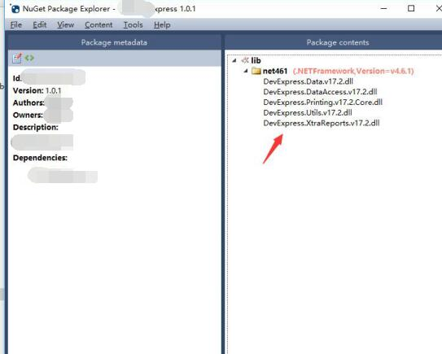
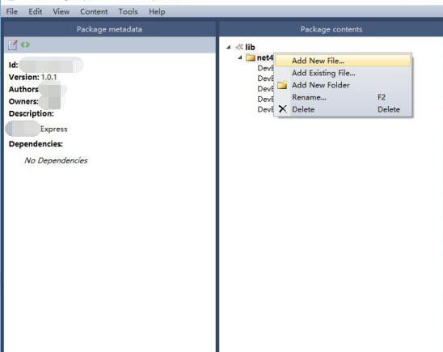

# 手动打包Nuget

1. 下载一个Nuget Package Explorer 在win10商店里就有

2. 打开一个已有packages底下的的nupkg包文件，或者新建一个nupkg包文件
    
3. 增加需要的dll到包里，并相应的修改版本号
    
4. 保存到一个新建文件夹里

5. Copy相应的可执行文件到同一文件夹（NuGet.Config, NuGet.exe, NuGet.targets）

6. 在PowerShell模式下，找到并进入这个文件夹，相应的修改下面的命令并执行
.\nuget push XXXX.DevExpress.1.0.3.nupkg -Source http://192.168.10.1:8081/repository/Local/ -ApiKey 11111111-1111-1111-1111-111111111111

7. 完成，新的包应该就在Nuget server上了